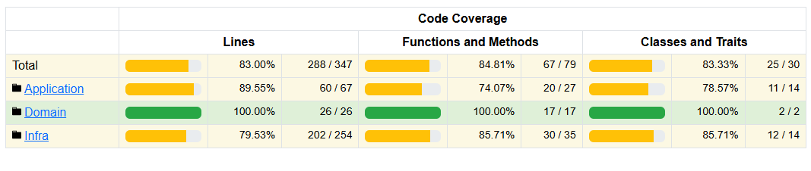

# Clean Architecture Authentication Project

This project is a **study-driven** initiative designed to explore **Clean Architecture principles**. To achieve this, a basic **authentication system using JWT** has been implemented from scratch, without any frameworks, to gain a deeper understanding of architecture and design patterns. As such, certain specific functionalities outside the scope of this study were omitted.

---

## Project Structure

The project is organized according to Clean Architecture principles, divided into the following main layers:

### Domain

- Contains **business rules** and **core entities** that define the system's core functionality.
- This layer is isolated from any specific infrastructure, which promotes modularity and makes the core of the system independent of external dependencies.

### Application

- Encapsulates **use cases** that orchestrate the flow of data between the domain and other layers.
- Contains input and output boundary interfaces, application services, and error handling, enabling a clear separation between user actions and system operations.

### Infra

- Implements the **infrastructure** components such as repositories, controllers, validators, and adapters.
- This layer manages interactions with external services and databases, ensuring they do not impact the domain logic.

---

## Infrastructure with Docker

The project is fully containerized using Docker for a seamless local environment setup. The Docker Compose configuration includes a **PostgreSQL** database container for data persistence.

---

## Unit Testing and Coverage

Unit tests are implemented to ensure the reliability of the system and are stored in the `/tests` directory. Test coverage reports are generated in `/tests/coverage`, providing insights into the portions of the codebase that are adequately tested.



---

## Getting Started

### Steps to Run Locally

Follow these instructions to set up and run the project locally:

```bash
# Step 1: Adjust environment file
cp .env.example .env

# Step 2: Start Docker containers in detached mode
docker-compose up -d

# Step 3: Insert database schema into PostgreSQL
docker exec -i clean-arch-postgres psql -U {{db-username:user}} -d {{db-database:clean-arch}}  < ./database/db.sql

# Step 4: Enter the application container
docker exec -it clean-arch-app bash

# Step 5: Run PHPUnit tests
phpunit tests --colors
```